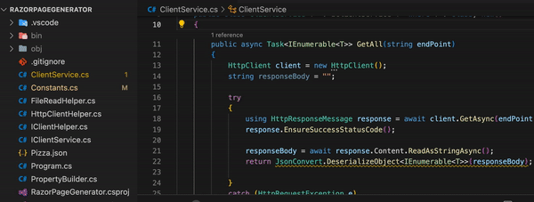

# Model and Client Service Auto-Generate from JSON result

This project contains a program that automatically generates C# model classes and client service methods from API responses.




 **Project Setup**:

   - Clone the repository: `git clone https://github.com/Username/ProjectName.git`
   - Navigate to the project directory: `cd ProjectName`
   - Edit your target path: Constant.cs --> public const string TargetFolder = "`{your_target_folder_path}`";


 **Running the Project**:

   - Navigate to the project directory in your console or terminal.
   - Use the following commands to build and run the project's code:

     ```bash 
     dotnet run <api-endpoint> <namespace> <typename>
     ```

